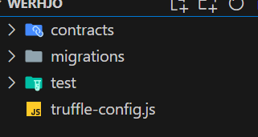

## truffle이란 
truffle이란 스마트컨트랙트를 위한 개발환경이다

공식문서: https://archive.trufflesuite.com/docs/truffle/

## tuffle 설치하기
truffle을 사용하기위해서는
Node.js와 Python 3.2가 필요하다

https://nodejs.org/ko

https://www.python.org/

위 두개 사이트에서 node.js와 python을 설치해주자

설치를 마쳤으면 truffle을 설치해준다
<pre>
npm install -g truffle
</pre>

## Ganache 설치하기

https://archive.trufflesuite.com/ganache/

공식문서: https://archive.trufflesuite.com/docs/ganache/

위 링크로 접속하여 가나슈를 설치해준다

가나슈란 로컬에서 가상의 이더리움 블록체인을 돌릴 수 있게 해주는 프로그램이다

## web3.js란
web3.js란 이더리움 네트워크와 상호작용 할 수 있는 자바스크립트 라이브러리이다

## web3.js 설치하기
truffle에는 기본적으로 web3가 내장되어있다 그렇기에 web3를 다룰줄 알아야되니 간단한 실습으로 web3를 배워보자 

web3를 사용해보기전 코드를 작성할 파일을 하나 생성해주자

파일을생성했다면 생성한 경로에 vscode를 실행시켜주고 
<pre>
npm init -y
</pre>
해당 명령어로 npm을 초기화시켜준뒤 web3 라이브러리를 설치해준다

## web3.js 사용하기
web3 가져오기 및 인스턴스 생성
<pre>
import { Web3 } from "web3";
const web3 = new Web3("http://127.0.0.1:7545");
</pre>

### 지갑조회 하기
<pre>
let accounts = await web3.eth.getAccounts(); // 전체 지갑 조회하기
let balance = await web3.eth.getBalance(accounts[0]); // 지갑 잔액 조회하기 
</pre>

### 트랜잭션 보내기

<pre>
await web3.eth.sendTransaction({
    from: accounts[0],
    to: a ccounts[1]
    value: 1000000000000000000 // 1 ether == 1000000000000000000 wei
})
</pre>

위 코드에서 value를 보면 1000000000000000000인것을 볼 수가 있는데 이렇게 작성하면 헷갈릴 수 있다

그래서 web3 라이브러리에는 더 편하게 사용할 수 있도록 하는 기능이 존재한다

### 이더 단위를 더 편리하게 사용하기
<pre>
value: web3.utils.toWei("1", "ether")
</pre>

### 알아두기
이더리움에서 금전적인 값은 내부적으로 wei로 계산된다

## truffle 사용하기
먼저 truffle을 사용할 폴더에서 아래명령어를 실행하여 truffle 프로젝트를 초기화 해준다
<pre>
truffle init
</pre>

위 명령어를 실행하게되면 다음과 같은 구조로 프로젝트가 구성된다

contracts 폴더에는 .sol 확장자의 스마트컨트랙트 코드가 담긴 파일을 저장한다

migrations 폴더에는 migration 관련 코드를 담은 파일을 저장한다

test폴더에는 test 코드를 저장한다 

먼저 기본적인 세팅을 위해 truffle-config.js을 켜준다

### 1. 컴파일러 설정
파일에서 다음과 같은 내용을 찾은뒤 원하는 컵파일러 버전으로 변경한다 
<pre>
  // Configure your compilers
  compilers: {
    solc: {
      version: "0.8.21",      // Fetch exact version from solc-bin (default: truffle's version)
      // docker: true,        // Use "0.5.1" you've installed locally with docker (default: false)
      // settings: {          // See the solidity docs for advice about optimization and evmVersion
      //  optimizer: {
      //    enabled: false,
      //    runs: 200
      //  },
      //  evmVersion: "byzantium"
      // }
    }
  },
</pre>

### 2. 네트워크 설정

주석을 푼뒤 가나슈를 참고하여 네트워크 설정을 수정해준다 
<pre>
    // development: {
    //  host: "127.0.0.1",     // Localhost (default: none)
    //  port: 8545,            // Standard Ethereum port (default: none)
    //  network_id: "*",       // Any network (default: none)
    // },
</pre>

물론 가나슈를 사용하지 않고 아래명령어를 이용해서 truffle에서 제공하는 로컬네트워크를 사용할 수도 있다

<pre>
truffle develop
</pre>

### Migration 작성하기 

먼저 배포할 컨트랙트를 contracts 폴더에 저장한다
그 후 migrations 폴더에
<pre>
숫자_마이그레이션이름 
</pre>
위와 같은 형식으로 파일을 생성해준다 위와 같은 파일 이름 형식으로 만드는 이유는 truffle은 파일의 앞자리 숫자를 이용하여 마이그레이션의 순서를 구분하기 때문이다

이제 마이그레이션 파일을 작성해보자
<pre>
const Migrations = artifacts.require("Migrations"); // 컨트랙트 가져오기

module.exports = function(deployer) {
  deployer.deploy(Migrations); // 배포하기
};
</pre>

### Migration 실행하기
<pre>
truffle migrate
</pre>

현재 파일구조에는 약간의 문제가 있다 

매번 배포할때마다 모든 마이그레이션이 배포되는 문제이다 이러한 문제를 해결하기 위해서는 마이그레이션 순서를 저장하는 스마트 컨트랙트를 만들어줘야한다

### Migration순서를 저장하는 컨트랙트 만들기
contract폴더안에 Migrations.sol파일을 생성해준뒤 다음내용을 작성해준다 
<pre>
pragma solidity >=0.4.22 <= 0.8.0;

contract Migrations {
  address public owner;
  uint256 public last_completed_migration;

  modifier restricted() {
    if (msg.sender == owner) _;
  }

  constructor() public {
    owner = msg.sender;
  }

  function setCompleted(uint completed) public restricted {
    last_completed_migration = completed;
  }

  function upgrade(address new_address) public restricted {
    Migrations upgraded = Migrations(new_address);
    upgraded.setCompleted(last_completed_migration);
  }
}
</pre>
migration폴더안에 1_initial_migration.js 파일을 생성해준뒤 다음내용을 작성해준다
<pre>
const Migrations = artifacts.require("Migrations");

module.exports = function(deployer) {
  deployer.deploy(Migrations);
};
</pre>

이렇게 직접 만들지 않고 
<pre>
truffle undo
</pre>
명령어를 이용해서 자동으로 생성하게 할 수도있다

이제 마이그레이션을 실행하면 가장최근의 마이그레이션만 실행되는걸 알 수 있다

### 테스트 코드 작성하기

<!-- truffle은 테스트를 위한 프레임 워크인 Mocha와 chai를 포함하고 있다 -->

test폴더에 js확장자 파일을 하나 만들어주고 다음과 같은 내용을 작성해준다
<pre>
const Simple = artifacts.require("Simple");

contract("test1", (account) => {
  it ("should not have zero address", async () => {
    const simpleInstance = await Simple.deployed();
    await assert.notEqual(simpleInstance.address, 0x0);
  });
});
</pre>
코드를 하나씩 살펴보자

contract는 테스트를 하는 함수 it은 각각의 테스트이다

contract callback 함수를 보면 accounts란 인자를 받고 있는데 

이는 로컬 네트워크에서 생성된 계정을 반환한다

### skip, only
skip과 only는 Mocha 테스트 프레임워크에 들어있는 기능이다 

skip은 해당 테스트를 건너뛰고 only는 해당 테스트만 실행한다
<pre>
contract.only("test", (accounts) = > {
  // 테스트를 건너뜀
  it.skip("test skip", async () => {
    ...
  })

  // 이 테스트만 실행함
  it.only("test skip", async () => {
    ...
  })
})
</pre>

contract에 only와 skip을 붙이는 경우는 여러 테스트 파일이 있을때 이 파일의 테스트를 스킵 / 실행할것 인지 정하는것이다  

### Chai

Chai란 truffle에 기본적으로 내장되어있는 단위를 테스트하는 테스트 프레임워크이다

단순 JS문법을 사용한 테스트 코드는 가독성이 좋지 않고등의 여러가지 단점이 존재한다 이러한 문제점을 해결하기 위해서 Chai를 사용한다
<pre>
</pre>

위 코드를 보면 보다
### 

이제 테스트코드를 실행시켜보자 
<pre>
truffle test
</pre>

위와 같은 명령어를 실행하면 테스트 코드가 잘 작동하는 것을 볼 수 있다

### Bignumber 산술하기
### 배포 스크립트 작성하기 