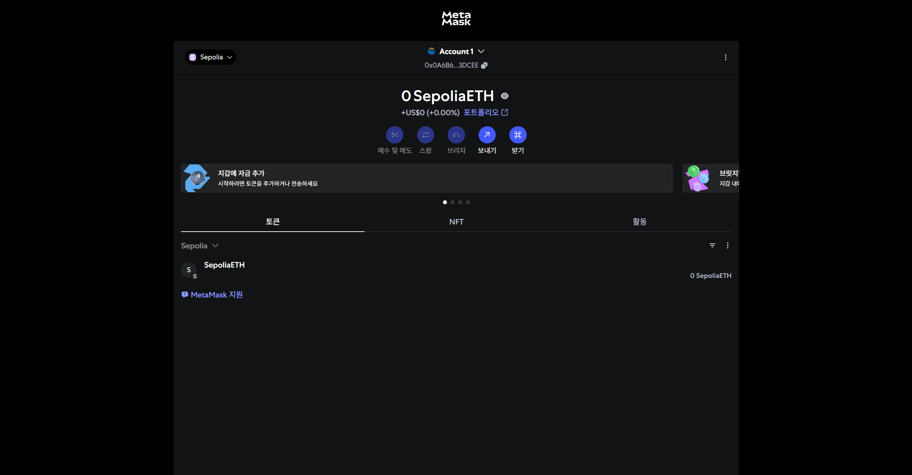
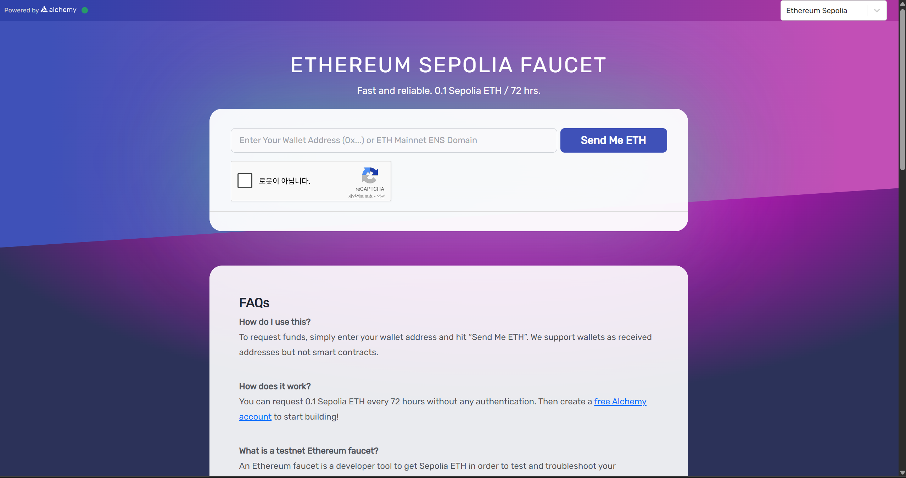
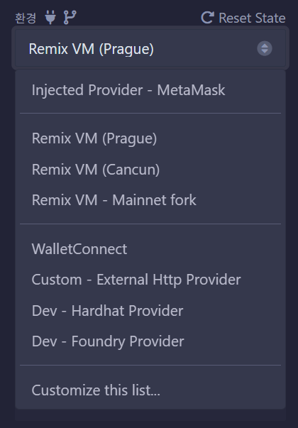
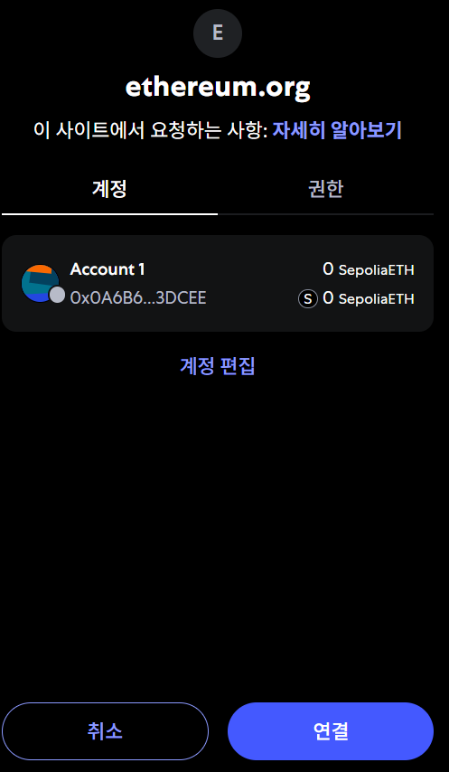

# 테스트네트워크에 배포하기
### 메타머스크 (MetaMask)
https://chromewebstore.google.com/detail/metamask/nkbihfbeogaeaoehlefnkodbefgpgknn?hl=ko

위 링크에서 메타머스크를 다운로드하고 지갑을 생성해준다

### 테스트 네트워크에서 이더 받기 (Sepolia 기준)

메타마스크 지갑에 접속한 뒤 테스트넷에 연결해준다

https://www.alchemy.com/faucets/ethereum-sepolia 
해당사이트에 접속한뒤 주소를 넣고 

Send Me ETH 버튼을 클릭해주면 테스트넷에서 이더를 받을 수 있다 

단 메인넷에 0.001ETH를 가지고 있어야 지급받을 수 있고 네트워크가 혼잡할 경우에는 지급을 받지 못할 수도 있다

이더도 받았으니 실제로 배포를 해보자

### 테스트 네트워크에 배포하기

( 로컬 Remix 에서는 연결할 수 없으니 온라인 Remix를 사용해야한다 )

Remix에 접속한뒤 배포 및 실행을 클릭한다

환경(ENVIRONMENT) 에서 injected Provider - MetaMask를 선택해준다

연결을 눌러 연결을 완료한뒤 스마트컨트랙트를 배포하면 
테스트넷에 배포할 수 있다
### Etherscan (이더스캔)

이더스캔(Etherscan)은 이더리움 블록체인에서 발생한 트랜잭션, 블록, 지갑 주소, 스마트 계약 등의 정보를 확인하고 검증할 수 있는 블록체인 탐색기(Blockchain Explorer)이다

https://etherscan.io/

위 사이트에 접속하여 이더리움 블록체인의 정보를 조회할 수 있다

https://sepolia.etherscan.io/

Sepolia 테스트 네트워크 같은 경우는 위 링크에서 정보를 조회할 수 있다